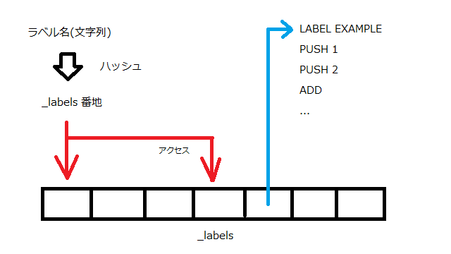
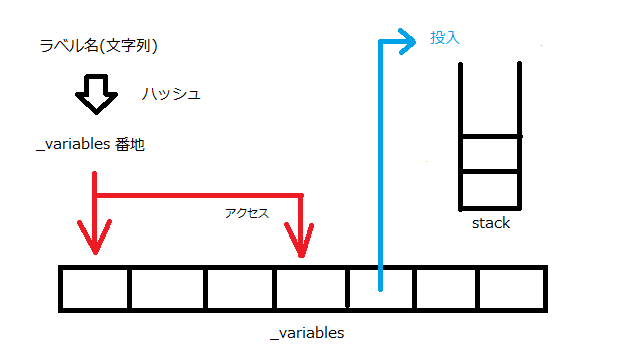

# いろんなメモを書き連ねていく

## 1. 設計ポリシーどうしようね...?

割とわかりやすい目標で行くなら並列化、実装としてはスタックを複数用意して...とかになるんだろうが、
あらかじめ配列とかの構造がないと効果が薄そう。

→ 3日くらいやった結果、それはコンパイラ層でやるべきであってここじゃなくていいな感が出た。

## 2. 分岐

if文を直接記述するのはもうちょっと高級な言語でやるほうがいい気がする。
(高級にすると別途パーサーが必要になるのでちょっと無理)。
なので疑似的に if を意味するセットを考える。

### 2.1 ジャンプ命令

#### 2.1.1 ラベル

ジャンプ命令や関数呼び出しのためにラベルがほしい、_labels というメモリ領域を
用意してそこにとび先アドレスを保持することにした。ラベル名はハッシュを用いて
unsigned short へとマップされている。多分いつか衝突する。



#### 2.1.2 JUMP命令

JUMP命令では オペランドとしてジャンプ先のラベルハッシュを保持している。
それを用いて _labels から情報を取得し、その値をプログラムカウンターに設定する。

#### 2.1.3 JPEQ0命令

JPEQ0命令では、スタックの一番上を取得し(popも行われる)、その値が0出会った場合
オペランドで指定した場所へJUMPする。判定が 0 なのは数値一致がそのほうが判定しやすいから。

### 2.2 分岐を記述する例

今スタックの上に積まれている数字が n か判定したいとき
(今スタックには数字aが1つ積まれているとする)

```txt
STORE a
PUSH n
SUB      // a - n
JPEQ0 とび先ラベル
LOAD a                  // こっちがfalse
何らかの処理
JUMP 脱出ラベル
LABEL とび先ラベル
LOAD a                  // こっちがtrue
何らかの処理
LABEL 脱出ラベル
続きの処理               // if脱出
```

なんか長くなっていやだなぁという気がしなくもないが、実装が楽なのでこうした。

## 3. ループ

とりあえず、ループを作るためには命令列が保存されてあったほうが楽そう。
インタプリタ形式だと私がアホなのでループの終わりのJUMP命令のアドレスを実行時に
決める方法がわからなかったので、**アーキテクチャとして命令列メモリが存在します!**、**実行前処理としてそこに命令列読み込みます!**、**ラベルは前処理で全部把握します!** とした。

サンプル → TestOperationFor.txt

## 4. 変数

### 4.2 ロード命令

本アーキテクチャ絵は仮想的に、変数の値が入っているテーブルを定義している。
ロード命令では、指定された番地から取得した値を現在のスタックの一番上に値を積む。
この時、指定された番地がもともと定義されていなかった場合(つまりスコープ外や未定義)
についても 0 が帰り、エラー終了などはされないものとする(なぜなら実装が簡単だから)。
また、_variables の最大サイズは unsigned short の最大値(USHRT_MAX+1 = 65535+1)とする。
理由としては命令定義時のオペランドが unsigned short として扱われるから。



### 4.3 ストア命令

ストア命令では、指定された番地に現在のスタックの一番上にあるものを移動する(popは行わない)。

## 5. コメント

デバッグがしづらったので作成。

```txt
#コメントをここに挿入
```

みたいに記述するとその行を無視してくれる。
\#とコメントの間に空白を入れるとうまく動かないので注意。
また、一応空行も無視してくれる。

## 6. 関数

### 6.1 関数定義 FUNC命令

実は命令でもなんでもなく、ラベルと同居している。エイリアスなので動作もリソースも共有。
なんなら頑張れば普通にラベルと衝突する。

### 6.2 関数呼び出し CALL命令

指定した関数を呼び出す。
使用するスタックは関数呼び出し後も共有(つまりスコープという概念がない)ため、呼び出し前に
PUSHしておけば関数内で使用できる。
関数の名前チェックちゃんとやらなきゃ。

### 6.3 関数終了 RET命令

関数の返り値はスタックに積まれたまんまの状態になるので
使う側が「この関数は何個帰ってくる?」とか「Store作業しなきゃ」とかいろいろ考える必要が
あるので面倒な仕様になっている。

## 7. プログラム終了 END命令

FUNCを適当に実装したら終了できなくなったので実装。

## アーキテクチャ仕様

### _instructions に入れる命令列フォーマット

全体が unsigned shortで、オペコード(16 bit) + オペランド(16 bit)の構成。
効率考えたらオペコードのサイズとかもう少し小さくしてもよかったけど、実装が楽だったので。

## 参考

- [プログラミング言語処理](http://www.hpcs.cs.tsukuba.ac.jp/~msato/lecture-note/comp-lecture/note8.html)
